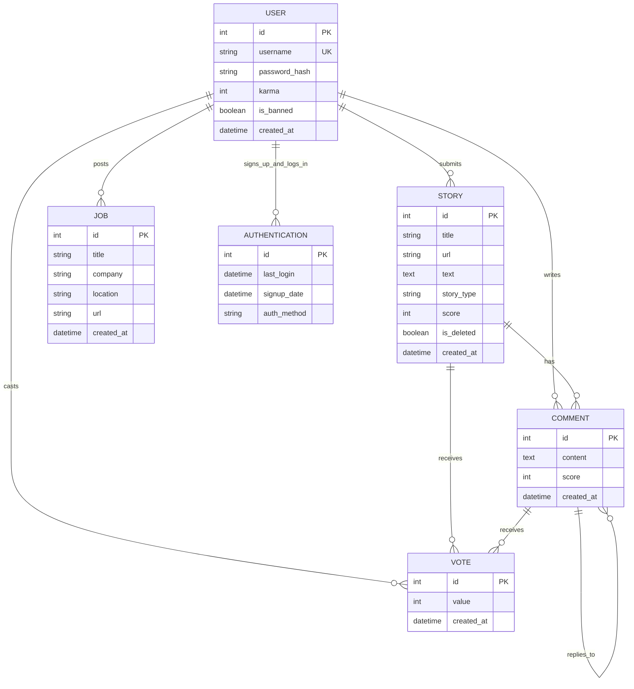

```mermaid
erDiagram
    USER {
        int id PK
        string username UK
        string password_hash
        int karma
        boolean is_banned
        datetime created_at
    }
    STORY {
        int id PK
        string title
        string url
        text text
        string story_type
        int score
        boolean is_deleted
        datetime created_at
    }
    COMMENT {
        int id PK
        text content
        int score
        datetime created_at
    }
    VOTE {
        int id PK
        int value
        datetime created_at
    }
    JOB {
        int id PK
        string title
        string company
        string location
        string url
        datetime created_at
    }
    AUTHENTICATION {
        int id PK
        datetime last_login
        datetime signup_date
        string auth_method
    }
    USER ||--o{ STORY : submits
    USER ||--o{ COMMENT : writes
    USER ||--o{ VOTE : casts
    USER ||--o{ JOB : posts
    USER ||--o{ AUTHENTICATION : signs_up_and_logs_in
    STORY ||--o{ COMMENT : has
    STORY ||--o{ VOTE : receives
    COMMENT ||--o{ COMMENT : replies_to
    COMMENT ||--o{ VOTE : receives


```
